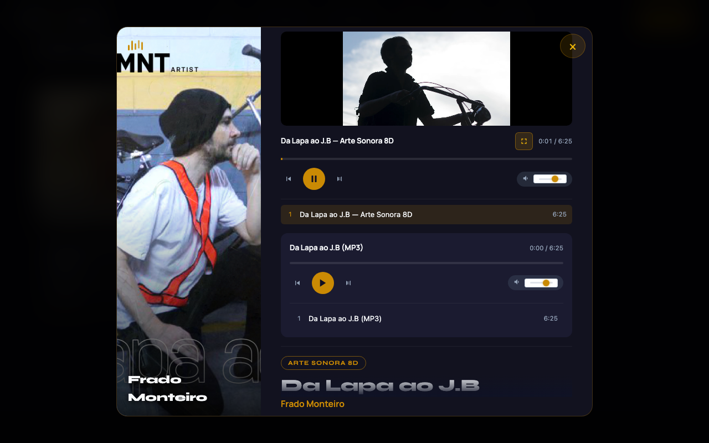
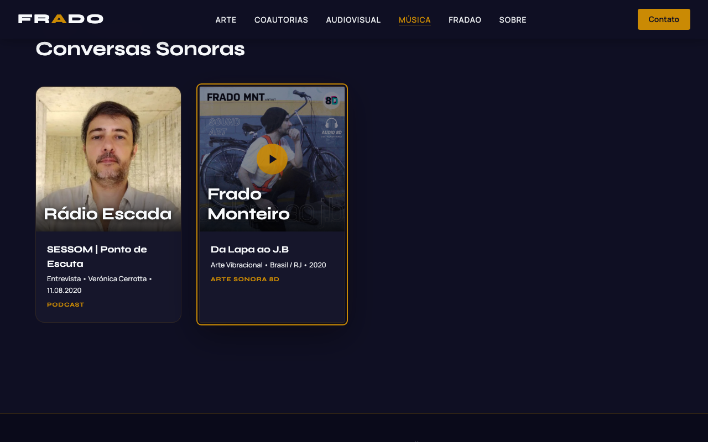

<p align="center">
  <strong>Frado Player</strong><br>
  <em>Unified audio &amp; video player for WordPress</em>
</p>

<p align="center">
  <a href="https://www.gnu.org/licenses/gpl-2.0.html"></a>
  
  
  
  
</p>

---

A self-contained WordPress plugin that delivers unified audio and video playback from a single `[frado_player]` shortcode. Spectrum analyzer, embedded playlist, automatic codec negotiation, ARIA accessibility, Media Session API, keyboard shortcuts, 60+ design tokens, and mobile/iOS support -- all with zero external dependencies.

Drop it into any WordPress site. No configuration page, no bloat, no jQuery.

---

## Preview

<p align="center">
  
</p>

<p align="center">
  <em>Modal player with spectrum analyzer, playlist, and track metadata</em>
</p>

<p align="center">
  
</p>

<p align="center">
  <em>Music cards with hover play overlay — dark theme integration</em>
</p>

---

## Features

- **Multi-codec audio** -- FLAC, Opus, AAC, MP3 with automatic browser negotiation
- **Multi-codec video** -- AV1, HEVC/H.265, H.264 with fullscreen and PiP
- **Spectrum analyzer** -- 30-band frequency visualizer via Web Audio API and `<canvas>`
- **Embedded playlist** -- server-rendered track list with active highlight and auto-advance
- **ARIA accessibility** -- `role="slider"`, `aria-live`, `aria-pressed`, `aria-current`, `prefers-reduced-motion`
- **Keyboard shortcuts** -- 15+ container-scoped shortcuts; multiple players never conflict
- **Media Session API** -- title, artist, artwork on OS lock screen and Bluetooth controls
- **Design tokens** -- 60+ `--fp-*` CSS custom properties, overridable globally or per-instance
- **State machine** -- formal `idle / loading / playing / paused / error` lifecycle with events
- **Zero dependencies** -- no jQuery, no frameworks, no external libraries
- **Mobile ready** -- `playsinline`, safe-area insets, pointer events, bottom-sheet playlist
- **Volume memory** -- persisted in `localStorage` across sessions

---

## Quick Start

```
[frado_player title="Northern Wind" artist="Jane Doe" src_mp3="/audio/track.mp3" duration="4:23"]
```

The browser selects the best codec it supports. No settings page needed -- it just works.

---

## Installation

**Option A: WordPress.org** (recommended)

1. Go to **Plugins > Add New**, search for **Frado Player**.
2. Click **Install Now**, then **Activate**.

**Option B: ZIP Upload**

1. Download `frado-player.zip` from [Releases](https://github.com/fradomnt/frado-player/releases).
2. Go to **Plugins > Add New > Upload Plugin**, choose the ZIP, install, and activate.

**Option C: Manual FTP/SFTP**

1. Upload the `frado-player/` directory to `wp-content/plugins/`.
2. Activate in **Plugins**.

Assets are enqueued automatically only on pages that use the shortcode.

---

## Shortcode Reference

```
[frado_player attribute="value" ...]
```

| Attribute | Type | Default | Description |
|-----------|------|---------|-------------|
| `src` | URL | -- | Generic source URL (fallback when codec-specific attrs are absent) |
| `src_flac` | URL | -- | FLAC source (highest audio priority) |
| `src_opus` | URL | -- | Opus source (Ogg container) |
| `src_aac` | URL | -- | AAC source (M4A/MP4 container) |
| `src_mp3` | URL | -- | MP3 source (universal fallback) |
| `src_av1` | URL | -- | AV1 video source (highest video priority) |
| `src_hevc` | URL | -- | HEVC / H.265 video source |
| `src_h264` | URL | -- | H.264 video source (universal video fallback) |
| `type` | string | `auto` | Force mode: `audio`, `video`, or `auto` |
| `title` | string | `Sem titulo` | Track title for header and Media Session |
| `artist` | string | -- | Artist name for Media Session |
| `thumb` | URL | -- | Cover art / poster image |
| `duration` | string | `0:00` | Pre-load duration hint (`m:ss` or `h:mm:ss`) |
| `color` | hex | -- | Per-instance accent override, e.g. `#7C3AED` |
| `tracks` | string | -- | Pipe-delimited playlist (see below) |
| `autoplay` | 0/1 | `0` | Attempt autoplay (subject to browser policies) |
| `loop` | 0/1 | `0` | Loop current track or entire playlist |

**Codec priority:** Audio: FLAC > Opus > AAC > MP3. Video: AV1 > HEVC > H.264.

---

## Playlist Format

The `tracks` attribute accepts pipe-delimited fields per track, comma-separated:

```
title | mp3 | flac | opus | aac | duration | thumb
```

| # | Field | Required | Description |
|:-:|-------|:--------:|-------------|
| 1 | title | Yes | Track display name |
| 2 | mp3 | No | MP3 source URL |
| 3 | flac | No | FLAC source URL |
| 4 | opus | No | Opus source URL |
| 5 | aac | No | AAC / M4A source URL |
| 6 | duration | No | Duration hint, e.g. `3:14` |
| 7 | thumb | No | Per-track cover art |

Omit a field with consecutive pipes (`||`). Whitespace is trimmed automatically.

```
[frado_player
  artist="Artist Name"
  thumb="/covers/album.jpg"
  tracks="Track One|/audio/01.mp3|/audio/01.flac||/audio/01.m4a|3:14|/covers/01.jpg,
          Track Two|/audio/02.mp3|||/audio/02.m4a|4:02,
          Track Three||/audio/03.flac|/audio/03.opus||5:30"
]
```

---

## Keyboard Shortcuts

Shortcuts activate when the player container has focus. Suppressed inside form elements and when modifier keys are held.

| Key | Action |
|-----|--------|
| `Space` / `K` | Play / Pause |
| `Left` / `Right` | Seek -/+ 5 seconds |
| `Up` / `Down` | Volume +/- 10% |
| `M` | Toggle mute |
| `F` | Toggle fullscreen (video) |
| `N` / `P` | Next / Previous track |
| `Home` / `End` | Seek to start / last 10s |
| `1` -- `9` | Jump to track N |
| `Escape` | Close bottom sheet / exit fullscreen |

All keyboard handling is container-scoped -- multiple players on one page never interfere.

---

## Design Tokens / Theming

Every visual property is controlled by a `--fp-*` CSS custom property. Override globally or per-instance:

```css
:root {
  --fp-accent:  #7C3AED;
  --fp-bg:      #0f0f0f;
  --fp-surface: #1a1a1a;
}

#frado-player-1 {
  --fp-accent: #059669;
}
```

Or use the `color` shortcode attribute: `[frado_player color="#7C3AED" ...]`

<details>
<summary><strong>Color Tokens</strong></summary>

| Token | Default | Description |
|-------|---------|-------------|
| `--fp-bg` | `#0F0F23` | Player background |
| `--fp-surface` | `#1B1B30` | Active row, seekbar track |
| `--fp-surface-2` | `#252A40` | Secondary surface |
| `--fp-surface-3` | `#2E3550` | Tertiary surface |
| `--fp-accent` | `#CA8A04` | Primary accent |
| `--fp-accent-bright` | `#EAB308` | Hover / focus accent |
| `--fp-accent-muted` | `#92400E` | Darker accent variant |
| `--fp-accent-glow` | `rgba(202,138,4,0.15)` | Glow behind accents |
| `--fp-accent-border` | `rgba(202,138,4,0.35)` | Accent-tinted border |
| `--fp-text` | `#F8FAFC` | Primary text |
| `--fp-text-muted` | `#94A3B8` | Secondary text |
| `--fp-text-disabled` | `rgba(248,250,252,0.38)` | Disabled text |
| `--fp-error` | `#EF4444` | Error state |
| `--fp-success` | `#22C55E` | Success state |
| `--fp-warning` | `#F59E0B` | Warning state |
| `--fp-border` | `rgba(255,255,255,0.08)` | Borders, separators |
| `--fp-border-focus` | `rgba(202,138,4,0.80)` | Focus ring |

</details>

<details>
<summary><strong>Typography Tokens</strong></summary>

| Token | Default | Description |
|-------|---------|-------------|
| `--fp-font-heading` | `'Syne', system-ui, sans-serif` | Heading stack |
| `--fp-font-body` | `'Manrope', system-ui, sans-serif` | Body stack |
| `--fp-font-mono` | `ui-monospace, 'SF Mono', monospace` | Mono stack |
| `--fp-text-xs` / `sm` / `base` / `lg` | `11px` / `12px` / `14px` / `16px` | Size scale |
| `--fp-fw-normal` / `medium` / `semibold` / `bold` | `400` / `500` / `600` / `700` | Weight scale |

</details>

<details>
<summary><strong>Spacing, Size &amp; Motion Tokens</strong></summary>

| Token | Default | Description |
|-------|---------|-------------|
| `--fp-space-1` .. `--fp-space-8` | `4px` .. `32px` | 4pt grid spacing scale |
| `--fp-btn-touch` | `44px` | Minimum touch target |
| `--fp-seekbar-h` / `h-hover` | `3px` / `5px` | Seekbar track height |
| `--fp-volume-w` | `80px` | Volume track width |
| `--fp-spectrum-h` | `32px` | Spectrum analyzer height |
| `--fp-playlist-max` | `220px` | Playlist max height |
| `--fp-radius` / `sm` / `lg` / `pill` | `12px` / `6px` / `20px` / `50px` | Border radii |
| `--fp-duration-fast` / `mid` / `enter` / `exit` | `150ms` / `250ms` / `300ms` / `200ms` | Transition durations |
| `--fp-ease-out` | `cubic-bezier(0.16, 1, 0.3, 1)` | Ease-out curve |

All motion tokens reset to `0ms` when `prefers-reduced-motion: reduce` is active.

</details>

---

## Standalone Embed

For non-WordPress sites (Wix, Squarespace, static HTML), use the standalone embed page via iframe:

```html
<iframe
  src="https://yoursite.com/wp-content/plugins/frado-player/frado-player-embed.html?title=Track&artist=Artist&src=/audio/track.mp3&duration=3:45&embed=1"
  width="100%"
  height="180"
  frameborder="0"
  allow="autoplay"
  style="border:none; border-radius:12px;"
></iframe>
```

Query parameters mirror the shortcode attributes: `title`, `artist`, `src`, `duration`, `thumb`, `color`.

---

## JavaScript Events

Frado Player fires `CustomEvent`s on the `.frado-player` container element.

| Event | `detail` | Fired When |
|-------|----------|------------|
| `fp:play` | `{ title }` | Playback starts or resumes |
| `fp:pause` | `{}` | Playback pauses |
| `fp:ended` | `{}` | Track reaches the end |
| `fp:trackloaded` | `{ title, duration }` | Metadata ready |
| `fp:timeupdate` | `{ currentTime, duration, pct }` | Every timeupdate tick |
| `fp:error` | `{ message }` | Source fails to load |
| `fp:statechange` | `{ from, to }` | State machine transition |

```js
const el = document.querySelector('.frado-player');
el.addEventListener('fp:play', (e) => console.log('Now playing:', e.detail.title));
```

Programmatic control is available via `el._fradoPlayer`:

```js
const p = document.querySelector('.frado-player')._fradoPlayer;
p.core.play();          p.core.pause();         p.core.seek(50);
p.volume.setVolume(80); p.volume.toggleMute();
p.playlist.next();      p.playlist.loadTrack(2);
p.state.current;        // 'idle' | 'loading' | 'playing' | 'paused' | 'error'
p.destroy();            // cleanup
```

---

## Browser Compatibility

| Codec / Feature | Chrome | Firefox | Safari | Edge | iOS Safari | Android Chrome |
|-----------------|:------:|:-------:|:------:|:----:|:----------:|:--------------:|
| MP3 | Yes | Yes | Yes | Yes | Yes | Yes |
| AAC / M4A | Yes | Yes | Yes | Yes | Yes | Yes |
| Opus | Yes | Yes | 15.4+ | Yes | 15.4+ | Yes |
| FLAC | Yes | Yes | Yes | Yes | 16+ | Yes |
| H.264 | Yes | Yes | Yes | Yes | Yes | Yes |
| HEVC / H.265 | Partial | No | Yes | Partial | Yes | Partial |
| AV1 | 80+ | 67+ | 16.4+ | 80+ | 16.4+ | 80+ |
| Web Audio API | Yes | Yes | Yes | Yes | Yes | Yes |
| Media Session | Yes | Yes | 15+ | Yes | 15+ | Yes |
| Fullscreen | Yes | Yes | 16.4+ | Yes | No* | Yes |

\* iOS Safari uses `webkitEnterFullscreen()` as a fallback. IE11 is not supported.

---

## Accessibility

Frado Player targets **WCAG 2.1 AA** compliance:

- **ARIA roles** -- `role="slider"` on seekbar/volume, `role="region"` on container, `aria-live="polite"` for announcements
- **Keyboard navigation** -- full control without a mouse; container-scoped to avoid page conflicts
- **Focus indicators** -- visible `focus-visible` ring using `--fp-border-focus`
- **Reduced motion** -- all `--fp-duration-*` tokens set to `0ms` under `prefers-reduced-motion: reduce`
- **Screen reader support** -- `aria-valuetext` with human-readable times, `aria-pressed` on toggle buttons, `aria-current` on active track

---

## Contributing

1. **Fork** the repository and create a feature branch from `main`.
2. **Test** with at least two browsers (Chrome + Firefox or Safari).
3. **Follow** the existing code style -- vanilla JS, no build step, no transpiler.
4. **Update** `CHANGELOG.md` under `[Unreleased]`.
5. **Submit** a pull request with a clear description.

Report bugs and request features via [GitHub Issues](https://github.com/fradomnt/frado-player/issues).

---

## License

Frado Player is free software licensed under the **[GNU General Public License v2.0 or later](https://www.gnu.org/licenses/gpl-2.0.html)**.

---

## Built by FRADO

Created by **[FRADO](https://frado.com.br)** -- 
GitHub: [@fradomnt](https://github.com/fradomnt)
